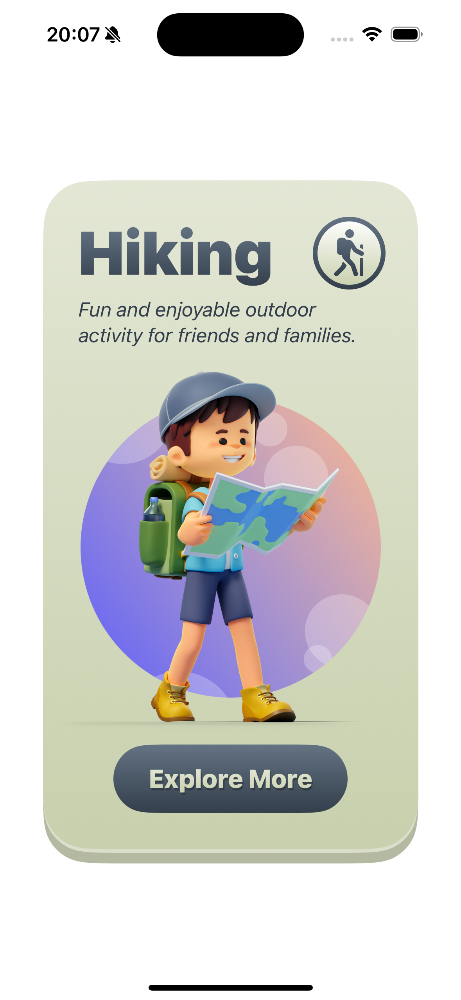
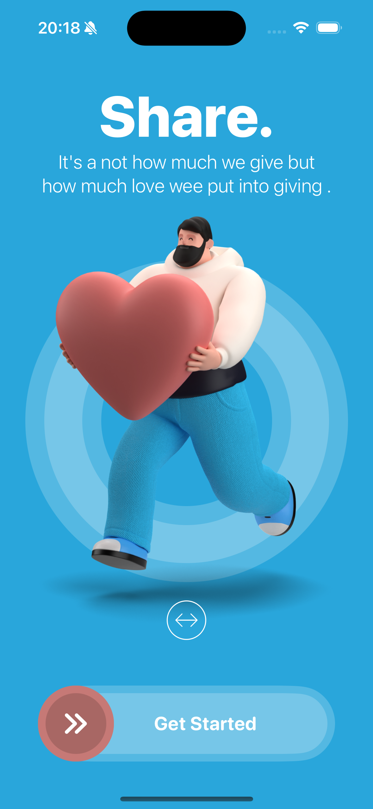
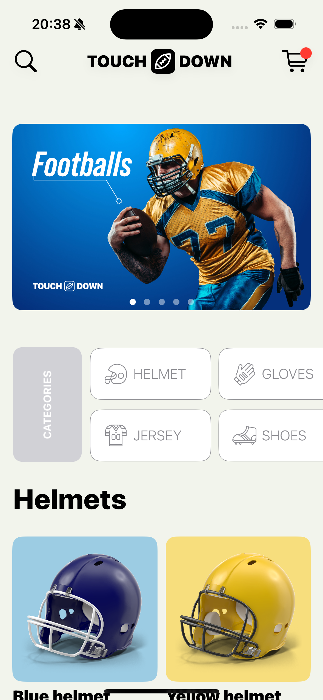
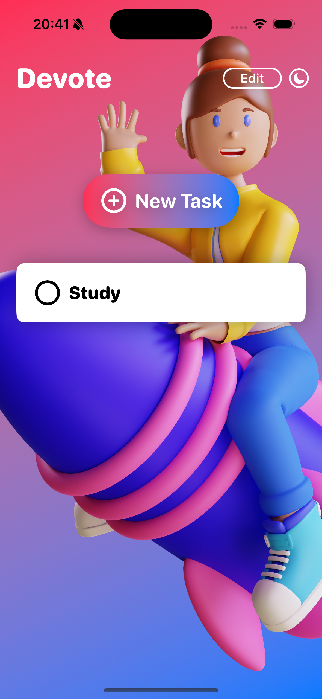

# study swiftUI

스위프트UI 공부

## SECTION 6 HIKE

## SECTION 7 RESTART

## SECTION 8 PINCH

## SECTION 9 FRUCTUS

## SECTION 10 AFRICA

## SECTION 11 TOUCHDOWN

## SECTION 12 DEVOTE

---

링크

> [Udemy 사이트](https://www.udemy.com/course/swiftui-masterclass-course-ios-development-with-swift)
